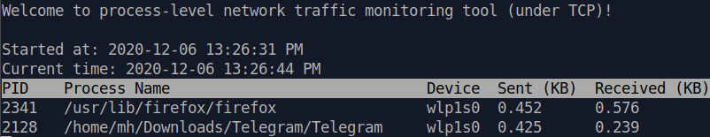

# netusage

This is a tool for monitoring the process-level network traffic usage. 
It listens to all the TCP packets and groups the usage by process.
[`NetHogs`](https://github.com/raboof/nethogs) is another tool which does the exact same task.

This was the first week's entry for the `#کدکچال` challenge founded by 
[monjar](https://github.com/monjar).

## Usage
You could easily run this tool by running the python script 
**under root privileges**.

And the only requirement is `psutil` package which helps us getting
the information about processes and can be easily installed using `pip`.

You could use `-d <interval>` argument to specify the interval of results
being printed in seconds. For example:
```commandline
sudo ./main.py -d 5
```

The result looks something like this:


This tool works fine on my Ubuntu and since I haven't used any Linux-dependant
library or tool and `psutil` is a cross-platform library, 
I think it will work on other operating systems.

## Stuff to do
Other that ones mentioned in the code itself, these are what I have in mind 
for improving this tool:
- Covering other network layer and transport layer protocols
- Making the code object oriented (Packet class, Process class, etc)
- Finding a better way of scheduling the `print_result` function 
which prints the result in each interval
- Adding more command line arguments
- Showing more information about the network and the packets

## Contributions
Any form of feedback (issues, pull requests, ...) would be a huge help for me
so thanks in advance! :)


## References
All the main code about reading the packets are from 
[this link](https://www.binarytides.com/python-packet-sniffer-code-linux/).
This link helped me a lot.

[`psutil` package documentation](https://psutil.readthedocs.io/en/latest/#)

